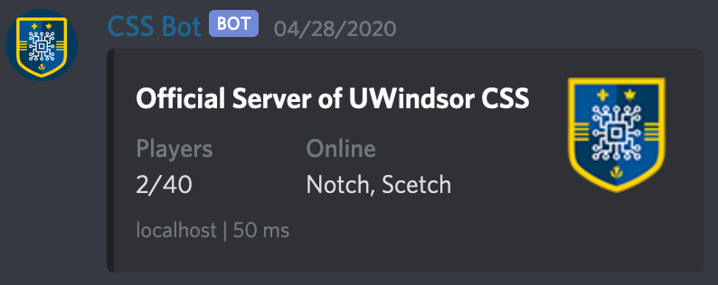

# mcping

_See [`mcping/`](mcping) for the library_

Discord bot written in Rust that pings a Java Minecraft server with a custom command and displays the status information in chat.



## Config

Create a config file called `config.toml` in the root directory of the project with the following:

```
token = ""
address = ""
command = ""
```

Where
- `token` is the discord bot token
- `address` is the Minecraft server address
- `command` is the command that will trigger the ping, for example `~ping` or `~minecraft`

## Running

In order to run the project you'll need [Rust](https://www.rust-lang.org/) installed. Once you have it installed and have created the config file you can run the project with `cargo run --release`.

## Library

The Discord bot is built on top of the [`mcping`](mcping) library, which can be integrated into your own application. It supports both Java and Bedrock servers and has an async implementation.

#### License

<sup>
Licensed under either of <a href="LICENSE-APACHE">Apache License, Version
2.0</a> or <a href="LICENSE-MIT">MIT license</a> at your option.
</sup>

<br>

<sub>
Unless you explicitly state otherwise, any contribution intentionally submitted
for inclusion in this crate by you, as defined in the Apache-2.0 license, shall
be dual licensed as above, without any additional terms or conditions.
</sub>
